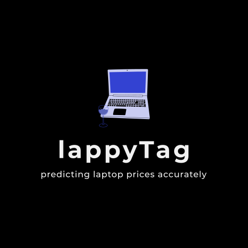

    

<h1 align="center">LappyTag: Intelligent Laptop Price Prediction</h1>

LappyTag is a machine learning-powered web application that helps users predict laptop prices based on their selected specifications. Whether you’re a consumer, retailer, or tech reviewer, this tool provides quick and accurate price estimates to help you make informed decisions.

🚀 Instant Price Predictions

📊 Machine Learning Powered

💻 Comprehensive Laptop Configurations

## 🚀 Live Demo  https://lappytag.streamlit.app/

## 🔹 Key Features
Brand & Model Selection: Choose from popular laptop brands and models, including gaming, business, and ultrabook types.
Hardware Specifications: Input RAM, CPU, storage (HDD/SSD), and GPU to specify laptop configurations.
Display Options: Customize display features with options for touchscreen, IPS technology, screen size, and resolution (auto-calculated PPI for accurate display assessment).
Instant Price Prediction: Powered by a trained machine learning model, LappyTag offers quick and precise price estimates with just one click.
User-Friendly Interface: Built with Streamlit, the application is designed for seamless user interaction, providing immediate results in an accessible format.

## 🔹 Technologies Used
* Python – Core programming language.
* Pandas & NumPy – Data processing and numerical computations.
* Scikit-Learn – Model training and prediction.
* Streamlit – Framework for creating an interactive web application.
* Pickle – Model persistence for efficient loading and execution.

## 🔹 Installation & Setup
Follow these steps to set up LappyTag locally:

### 1. Clone the repository:
git clone https://github.com/hardiksharma0511/LappyTag.git
cd LappyTag

### 2. Run the application:
streamlit run app.py

## 🔹 How It Works
LappyTag leverages a machine learning pipeline trained on a dataset of laptop specifications and prices. The pipeline preprocesses features like brand, CPU, GPU, and display properties, and applies a regression model to predict prices accurately.

### Key Components
* Feature Engineering: Categorical encoding, binary encoding for touchscreen/IPS, and display PPI calculation.
* Model: Regression model fine-tuned to deliver accurate predictions.

## 🔹 Project Goals
* Accurate Price Prediction: Reliable price estimates for various laptop configurations.
* Enhanced User Experience: Simple, intuitive UI for smooth interaction.
* Real-World Application: Targeted for e-commerce, retail, and tech journalism use cases.

## 🔹 Why LappyTag?
LappyTag exemplifies the use of machine learning in solving practical, industry-relevant challenges. The project highlights skills in:

* Data Science & Machine Learning: Effective feature engineering, model training, and validation.
* Web Application Development: Streamlit-powered UI for accessibility and ease of use.
* Real-World Relevance: LappyTag can be applied across various fields, from retail analysis to personalized consumer assistance.

## 🔹 License
This project is licensed under the MIT License.

🔹 Future Improvements
I am actively working on enhancing LappyTag with:

Improved Model Accuracy: Exploring advanced algorithms to refine prediction precision.
Additional Features: Incorporating new specifications and expanding the dataset for broader coverage.
User Experience: Enhancing UI/UX for smoother, more engaging interactions.

